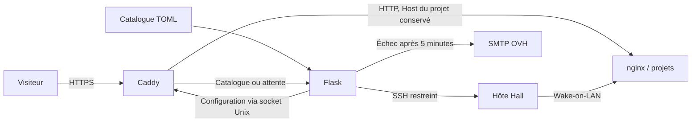

<div align="center">

# Auditio Infrastructure

**Un catalogue public. Un accès HTTPS par projet. Un serveur réveillé à la demande.**

[Démarrer](hall/DEPLOYMENT.md) · [Configuration](hall/documentation/CONFIGURATION.md) · [Exploitation](hall/documentation/OPERATIONS.md) · [Contribuer](CONTRIBUTING.md)

</div>

---

## L'infrastructure actuelle

Hall est la passerelle hébergée sur le Raspberry Pi. Caddy termine les connexions HTTPS et transmet chaque sous-domaine de projet à nginx sur le serveur distant. Flask fournit le catalogue et prend en charge le réveil lorsque le serveur ne répond plus.

| Composant | Responsabilité | Accès |
| :--- | :--- | :--- |
| **Caddy** | HTTPS, certificats OVH, proxy par sous-domaine | Ports publics 80 et 443 |
| **Flask / Gunicorn** | Catalogue TOML, synchronisation, attente, WoL et alertes | Réseau Docker uniquement |
| **Hôte Hall** | Envoi WoL via une commande SSH restreinte | LAN |
| **Serveur des projets** | nginx et applications | `http://192.168.1.137:80` |



> [!NOTE]
> L'accès aux projets est public et sans cookie Hall. L'authentification éventuellement nécessaire appartient à chaque application distante. Hall ne gère ni leur démarrage individuel ni l'arrêt du serveur.

## Démarrage

Le code de Hall reste un **sous-module Git** distinct du dépôt d'infrastructure.

```bash
git submodule update --init hall
cd hall
cp .env.hall.exemple .env
```

Renseigner les variables DNS OVH, SSH et SMTP, puis préparer la clé SSH et le fichier `known_hosts` comme indiqué dans le [guide de déploiement](hall/DEPLOYMENT.md).

```bash
docker compose up --build -d
docker compose ps
```

Le catalogue est accessible à **https://testing.audit-io.fr**. La configuration actuelle contient **EMSC**, à **https://emsc.testing.audit-io.fr**.

> [!WARNING]
> Ne pas remplacer un fichier `.env` existant avec le modèle. Ne pas utiliser `docker compose down -v` en maintenance : les volumes contiennent les certificats et la limitation persistante des alertes.

## Documentation

| Guide | Pour quoi faire ? |
| :--- | :--- |
| [Hall](hall/README.md) | Comprendre les routes, modules et comportements |
| [Déploiement](hall/DEPLOYMENT.md) | Installer Docker, les secrets et le réveil SSH |
| [Configuration](hall/documentation/CONFIGURATION.md) | Ajouter un projet, configurer OVH et SMTP |
| [Exploitation](hall/documentation/OPERATIONS.md) | Vérifier les services et résoudre les incidents |
| [Contribution](CONTRIBUTING.md) | Tester les changements et travailler avec le sous-module |
| [Sécurité](SECURITY.md) | Protéger les accès et signaler une vulnérabilité |
| [Historique](DONE.md) | Distinguer les anciennes fonctions de l'architecture actuelle |

## Organisation

```text
auditio-infra/
├── hall/                 Application, proxy, tests et documentation
├── README.md             Vue d'ensemble
├── CONTRIBUTING.md       Workflow de développement
├── SECURITY.md           Politique de sécurité
└── DONE.md               Historique
```

Les anciens composants ERP, API Testing, administration Hall et Traefik ont été retirés du périmètre actif. Leur historique reste consultable dans Git. Cette suppression ne désinstalle aucun service sur les autres machines.

## Licence

Voir [LICENCE.md](LICENCE.md) et le [code de conduite](CODE_OF_CONDUCT.md).